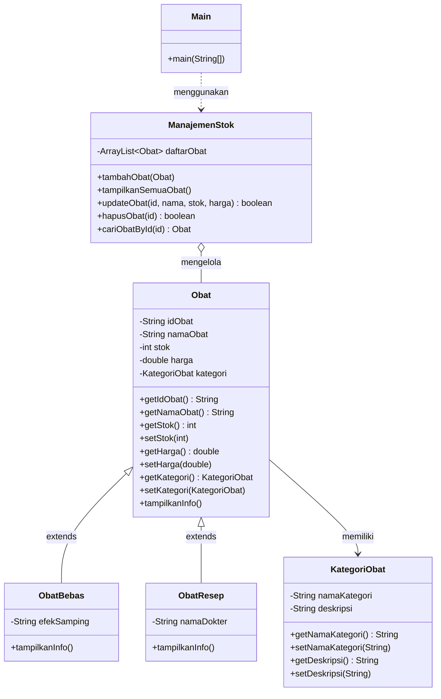

# Sistem Manajemen Stok Obat Apotek
 
Program console berbasis Java untuk mengelola stok obat apotek menggunakan konsep **Pemrograman Berorientasi Objek (PBO)**.
 
---
 
## 1. Identitas Mahasiswa
 
| Keterangan | Data |
|------------|------|
| Nama | Muhammad Ihsan Kamil |
| NIM | 2509116035 |
| Kelas | A 2025 |
| Mata Kuliah | Pemrograman Berorientasi Objek |
 
---
 
## 2. Studi Kasus yang Dipilih
 
**Studi kasus: Manajemen Stok Obat pada Apotek.**
 
Apotek perlu mencatat obat yang tersedia beserta stok dan harganya. Obat tidak semuanya sama, sehingga dibedakan menjadi dua jenis:
 
| Jenis Obat | Ciri | Data Khusus yang Disimpan |
|------------|------|---------------------------|
| **Obat Bebas** | Dapat dibeli tanpa resep | Efek samping |
| **Obat Resep (Obat Keras)** | Harus dengan resep dokter | Nama dokter |
 
Kedua jenis obat punya data dasar yang sama (ID, nama, stok, harga, kategori), tetapi berbeda pada data khususnya. Kondisi inilah yang cocok diselesaikan dengan **inheritance**: data yang sama ditaruh di satu *superclass*, data yang berbeda ditaruh di *subclass* masing-masing.
 
### Fitur Program (CRUD)
 
| Menu | Fitur | Keterangan |
|------|-------|------------|
| 1 | Tampilkan Semua Obat | Read – menampilkan data dalam bentuk tabel |
| 2 | Tambah Obat Baru | Create – menambah obat bebas atau obat resep |
| 3 | Ubah Data Obat | Update – mengubah nama, stok, dan harga berdasarkan ID |
| 4 | Hapus Obat | Delete – menghapus obat berdasarkan ID |
| 5 | Keluar | Menghentikan program |
 
Saat program dijalankan, sudah tersedia **2 data awal (dummy)**:
 
| ID | Nama | Jenis | Stok | Harga | Keterangan |
|----|------|-------|------|-------|------------|
| OBT01 | Paracetamol | ObatBebas | 50 | Rp 5.000 | Efek: Mengantuk |
| OBT02 | Amoxicillin | ObatResep | 20 | Rp 12.000 | Dokter: dr. Rizki |
 
---
 
## 3. Diagram Kelas dan Hierarki Class
 
### 3.1 Struktur File
 
Seluruh file berada dalam satu package `SistemManajemenObat`:
 
```
SistemManajemenObat/
├── Main.java            → menu & input pengguna
├── ManajemenStok.java   → operasi CRUD pada ArrayList<Obat>
├── Obat.java            → SUPERCLASS
├── ObatBebas.java       → SUBCLASS (extends Obat)
├── ObatResep.java       → SUBCLASS (extends Obat)
└── KategoriObat.java    → data kategori (dipakai oleh Obat)
```
 
### 3.2 Diagram Kelas
 

 
### 3.3 Penjelasan Hierarki
 
```
              Obat  (Superclass)
        idObat, namaObat, stok, harga, kategori
                     │
         ┌───────────┴───────────┐
         │                       │
     ObatBebas               ObatResep
  (+ efekSamping)          (+ namaDokter)
     Subclass 1              Subclass 2
```
 
| Class | Peran | Keterangan |
|-------|-------|------------|
| `Obat` | Superclass | Menyimpan atribut dan perilaku yang dimiliki semua obat |
| `ObatBebas` | Subclass | Mewarisi `Obat`, menambah atribut `efekSamping` |
| `ObatResep` | Subclass | Mewarisi `Obat`, menambah atribut `namaDokter` |
| `KategoriObat` | Class pendukung | Dipakai `Obat` sebagai atribut (hubungan *has-a*, bukan inheritance) |
| `ManajemenStok` | Class pengelola | Menyimpan `ArrayList<Obat>` dan menyediakan operasi CRUD |
| `Main` | Class utama | Menampilkan menu dan membaca input pengguna |
 
---
 
## 4. Penjelasan Bagian Kode yang Menerapkan Inheritance
 
### 4.1 Superclass: `Obat`
 
File `Obat.java` berisi atribut yang dimiliki semua jenis obat:
 
```java
public class Obat {
    private String idObat;
    private String namaObat;
    private int stok;
    private double harga;
    private KategoriObat kategori;
 
    public Obat(String idObat, String namaObat, int stok, double harga, KategoriObat kategori) {
        this.idObat = idObat;
        this.namaObat = namaObat;
        setStok(stok);
        setHarga(harga);
        this.kategori = kategori;
    }
    ...
    public void tampilkanInfo() { ... }
}
```
 
### 4.2 Subclass 1: `ObatBebas`
 
```java
public class ObatBebas extends Obat {          // (1) pewarisan dengan 'extends'
    private String efekSamping;                // (2) atribut khusus subclass
 
    public ObatBebas(String idObat, String namaObat, int stok, int harga,
                     KategoriObat kategori, String efekSamping) {
        super(idObat, namaObat, stok, harga, kategori);   // (3) memanggil constructor superclass
        this.efekSamping = efekSamping;
    }
 
    @Override
    public void tampilkanInfo() {              // (4) method overriding
        super.tampilkanInfo();                 // (5) memakai method milik superclass
        System.out.printf(" %-22s |\n", "Efek: " + efekSamping);
    }
}
```
 
### 4.3 Subclass 2: `ObatResep`
 
```java
public class ObatResep extends Obat {          // (1) pewarisan dengan 'extends'
    private String namaDokter;                 // (2) atribut khusus subclass
 
    public ObatResep(String idObat, String namaObat, int stok, double harga,
                     KategoriObat kategori, String namaDokter) {
        super(idObat, namaObat, stok, harga, kategori);   // (3) memanggil constructor superclass
        this.namaDokter = namaDokter;
    }
 
    @Override
    public void tampilkanInfo() {              // (4) method overriding
        super.tampilkanInfo();                 // (5) memakai method milik superclass
        System.out.printf(" %-22s |\n", "Dokter: " + namaDokter);
    }
}
```
 
### 4.4 Keterangan Poin Inheritance
 
| No | Kode | Penjelasan |
|----|------|------------|
| 1 | `extends Obat` | Menyatakan bahwa `ObatBebas` dan `ObatResep` adalah turunan `Obat`, sehingga otomatis memiliki atribut dan method milik `Obat` (ID, nama, stok, harga, kategori, getter/setter). |
| 2 | `private String efekSamping` / `namaDokter` | Atribut yang hanya ada di masing-masing subclass, sehingga tidak perlu dimasukkan ke `Obat`. |
| 3 | `super(idObat, namaObat, stok, harga, kategori)` | Meneruskan data umum ke constructor `Obat` supaya tidak perlu menulis ulang proses pengisian atribut. |
| 4 | `@Override tampilkanInfo()` | Subclass menimpa method milik superclass untuk menambahkan kolom keterangan khusus. |
| 5 | `super.tampilkanInfo()` | Memanggil versi method di `Obat` (mencetak ID, nama, kategori, stok, harga) lalu subclass melanjutkan dengan kolom miliknya. |
 
### 4.5 Inheritance saat Program Berjalan
 
Pada `ManajemenStok.java`, satu `ArrayList<Obat>` bisa menampung kedua jenis obat sekaligus:
 
```java
private ArrayList<Obat> daftarObat = new ArrayList<>();
...
for (Obat o : daftarObat) {
    o.tampilkanInfo();
}
```
 
Variabel `o` bertipe `Obat`, tetapi Java otomatis menjalankan `tampilkanInfo()` milik `ObatBebas` (tampil `Efek: ...`) atau `ObatResep` (tampil `Dokter: ...`) sesuai objek yang sebenarnya. Inilah alasan satu perulangan cukup untuk menampilkan dua jenis obat dengan keterangan berbeda.
 
Pembuatan objek di `Main.java`:
 
```java
Obat ob1 = new ObatBebas("OBT01", "Paracetamol", 50, 5000, bebas, "Mengantuk");
Obat ob2 = new ObatResep("OBT02", "Amoxicillin", 20, 12000, keras, "dr. Rizki");
```
 
Objek subclass dapat disimpan dalam variabel bertipe superclass (`Obat`) karena `ObatBebas` dan `ObatResep` *adalah sebuah* `Obat`.
 
---
 
## 5. Tangkapan Layar Program
 
Berikut dokumentasi program Sistem Manajemen Obat pada Apotek
 
### 5.1 Program Pertama Kali Dijalankan (Menu Utama)
 
Menampilkan menu 1–5 saat program dijalankan.
 

 
### 5.2 Menu 1 – Tampilkan Semua Obat
 

 
### 5.3 Menu 2 – Tambah Obat Bebas
 

 
### 5.4 Menu 2 – Tambah Obat Resep
 
Pilih kategori `2`, tipe `2`, lalu isi nama dokter.
 

 
### 5.5 Menu 3 – Ubah Data Obat
 

 
### 5.6 Menu 4 – Hapus Obat
 
Hapus obat berdasarkan ID, lalu tampilkan dengan menu 1.


 
### 5.7 Menu 5 – Keluar
 

 
---

<p align="center">Dibuat oleh <b>Muhammad Ihsan Kamil</b> – Pemograman Berbasis Objek</p>
